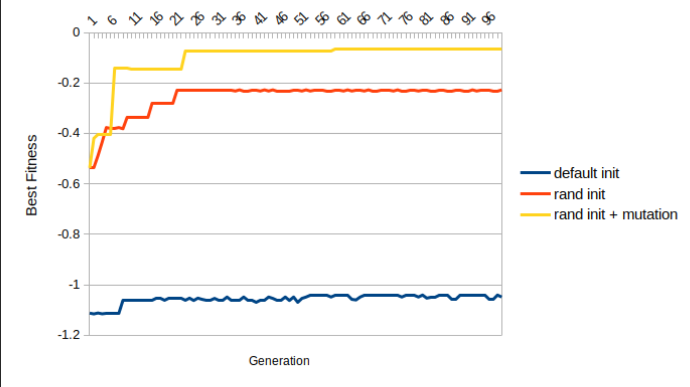
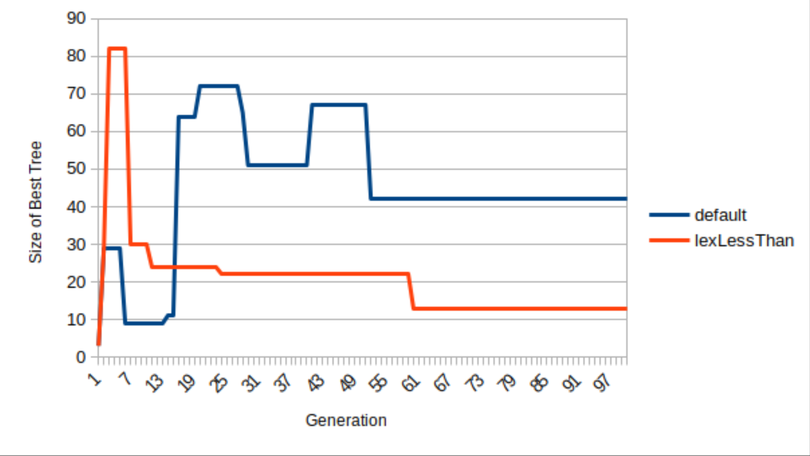

```Data Structures and Algorithms 

Assignment 3: Genetic Programming in Reinforcement Learning

## Instructions 

Genetic Programming experiment to solve the Cart Centering (isotropic rocket) problem. This application of trees is discussed in detail in lectures during the week of March 2.

The code extends the LinkedBinaryTree class from chapter 7 of the Goodrich text such that LinkedBinaryTree objects can represent expression trees.

Evolve trees for 100 generations and print statistics on the best tree at each generation. Your task involves the following parts: 


You should see a significant improvement in the best fitness after implementing createRandExpressionTree, and a further improvement after implementing the mutation operators. When plotted, the data should look something like the following plot. The blue line is the original code without modification. The red line shows results when the population is initialized with random trees. The yellow line shows results when the population is initialized with random trees and both mutation operators are implemented.
```


```
Plot your results in the above format after implementing your functions. I used Excel but any plotting tool is fine. Your submission for part 1 must include your plot and the printout of the best individual evolved using mutation in exactly this format (note your tree will differ): 


Implement a comparator ADT called LexLessThan which performs a lexicographic comparison of two trees $T1$ and $T2$ as follows: If the scores of $T1$ and $T2$ differ by less than 0.01, then $T1$ is “less than” $T2$ if $T1$ has more nodes than $T2$. Otherwise, compare the trees by their fitness score. The goal of using this comparator is to favour simpler trees only when their fitness scores are similar. A line plot comparing the size of the best tree during evolution with and without the LexLessThan comparator might look like the following: 



Try adding a crossover operator in which you randomly sample two parents and create two children by swapping random subtrees from each parent. You must determine where and how to add this feature. Crossover is typically applied before mutation. When results are ready, add a line to your plot labelled “rand init + xover + mutation” to show the results of this experiment.


## Animation
Program will display a simple animation of the best tree interacting with the Cart Centering simulator. 


